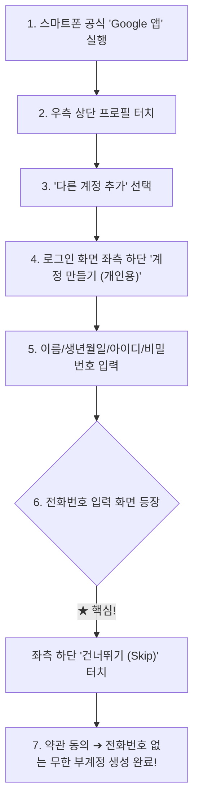

# ⚡ Free API Harvest Hub (Developer & AI Free Tier Auto-Provisioning Skill)

[](https://github.com/flam-ing)
[](https://opensource.org/licenses/MIT)
[](https://github.com/flam-ing/free-api-harvest-hub)

> **21개 글로벌 개발자 & AI 서비스에서 무료 플랜(Free Tier) API 키 및 자격 증명을 전자동·반자동으로 수집, 검증, 로테이션하고 OCI / Vercel 봇에 즉각 주입하는 실전 에이전트 스킬입니다.**

---

## 📱 0. 【모든 것의 시작】 스마트폰 '구글 앱'으로 전화번호 없이 무한 부계정 생성법

PC 브라우저(크롬 등)에서 구글 계정을 만들면 **100% 확률로 전화번호 인증(SMS)**을 요구하여 다계정 생성이 막힙니다.  
**반드시 스마트폰(iOS / Android)의 공식 "Google 앱"**을 통해 생성해야 전화번호 인증을 `건너뛰기`할 수 있습니다. 이것이 45개 이상의 무료 API 계정을 확보하는 절대적인 첫 단추입니다.



### 💡 모바일 생성 시 핵심 체크포인트 (전화번호 우회 꿀팁)
1. **사파리/크롬 웹이 아닌 공식 "Google 앱" 사용**: 모바일 OS의 디바이스 신뢰 토큰을 타기 때문에 번호 인증을 강제하지 않습니다.
2. **Wi-Fi보다 모바일 데이터(LTE/5G) 권장**: 동일 IP에서 연속 생성 시 번호 요구가 뜰 수 있으므로, 비행기 탑승 모드를 3초 켰다 끄면 IP가 리셋되어 계속 생성 가능합니다.
3. **통일된 비밀번호 규칙 권장**: 대량 계정 관리를 위해 `YOUR_PASSWORD_HERE` 등 자신만의 통일된 비밀번호를 지정해 에이전트 자동화 스크립트에 바로 등록합니다.

---

## 📊 1. 검증 완료된 21개 전체 서비스 무료 API 풀

초기 목표로 한 **21개 전체 개발자 & AI 서비스**의 실증 성공 키 규격과 에이전트 활용 역량입니다:

| 번호 | 분류 | 대상 서비스 | 실증 성공 키 규격 | 실제 활용 역량 |
| :---: | :--- | :--- | :--- | :--- |
| **1** | **코드 & 인프라** | **GitHub** 🏆 | `ghp_...` (Classic PAT) | Actions CI/CD 트리거, 패키지(`ghcr.io`) 배포, 레포/PR/스타/팔로우 자동화 |
| **2** | **초고속 LLM** | **Google Gemini** 🏆 | `AIzaSy...` (Gemini 2.5) | 분당 15 RPM, 일 1,500회 무료. 숏폼 대본 자동 작성 및 초거대 문서 분석 |
| **3** | **초고속 LLM** | **Groq Cloud** 🏆 | `gsk_...` (Llama 3.3) | 800 tps 초고속 추론 및 Whisper STT 초정밀 오디오 전사 (0.3초 응답) |
| **4** | **임베딩/검색** | **Cohere** 🏆 | `2ew...` (API Key) | Rerank 3 검색 결과 정밀 재정렬 및 Embed v3 다국어 벡터 임베딩 |
| **5** | **멀티 라우팅** | **OpenRouter** 🏆 | `sk-or-v1-...` | Claude 3.5 Sonnet, GPT-4o, DeepSeek 등을 단일 엔드포인트로 로테이션 |
| **6** | **오픈소스 AI** | **Hugging Face** 🏆 | `hf_...` (Access Token) | 최신 오픈소스 모델 Serverless 추론 및 Spaces 데모 앱 원격 자동 배포 |
| **7** | **인공지능 성우** | **ElevenLabs** 🏆 | `sk_...` | 월 10,000자 무료 고품질 한국어 성우 더빙 (`eleven_multilingual_v2`) |
| **8** | **이메일 인프라**| **Resend** 🏆 | `re_...` | 매월 3,000건 이메일 무료 발송 (React Email 템플릿 연동) |
| **9** | **AI 검색 엔진**| **Tavily AI Search** 🏆 | `tvly-dev-...` | 매월 1,000회 웹 검색 무료 (광고/불필요 태그 제거 클린 마크다운) |
| **10** | **웹 스크래핑** | **Firecrawl** 🏆 | `fc-...` | 동적 JS SPA 페이지를 LLM 친화적 마크다운으로 무인 크롤링 |
| **11** | **서버리스 DB** | **Neon Postgres** 🏆 | `napi_...` | Git 스타일 브랜칭 지원 PostgreSQL (0.5GB 무료 + Auto-suspend 0원 유지) |
| **12** | **엣지 DB** | **Turso (LibSQL)** 🏆 | `eyJ...` (JWT Token) | 전 세계 엣지 1ms 응답 분산 SQLite (로컬-클라우드 실시간 양방향 동기화) |
| **13** | **BaaS 백엔드** | **Supabase** 🏆 | `sbp_...` + Anon/Service | Postgres DB, Auth 인증, Storage, 실시간 웹소켓 통합 백엔드 |
| **14** | **CDN & 저장소**| **Cloudflare R2** 🏆 | `cfat_...` + S3 Key | **Egress(다운로드 전송료) 완전 0원**의 AWS S3 호환 대용량 미디어 스토리지 |
| **15** | **미디어 CDN** | **Cloudinary** 🏆 | API Key & Secret | URL 파라미터만으로 9:16 쇼츠 세로 크롭, 자막 오버레이, WebP 최적화 |
| **16** | **프로덕트 분석**| **PostHog** 🏆 | `phc_...` | 매월 1M 이벤트 무료 + 유저 마우스/화면 세션 녹화(Session Replay) |
| **17** | **비디오 스트리밍**| **Mux Video** 🏆 | Token ID / Secret | HLS 고화질 적응형 비트레이트 비디오 스트리밍 & 자동 자막 추출 |
| **18** | **사용자 인증** | **Clerk Auth** 🏆 | Publishable / Secret Key | 50,000 MAU 무료 소셜 로그인 및 사용자 세션 관리 |
| **19** | **서버리스 Redis**| **Upstash** 🏆 | REST URL / Token | API 요청 속도 제한기(Rate Limiting) 및 서버리스 큐(QStash) |
| **20** | **시맨틱 검색** | **Jina AI** 🏆 | `jina_...` | URL 앞에 `r.jina.ai/` 붙여 웹 문서를 즉각 LLM용 텍스트로 리더 변환 |
| **21** | **NoSQL 클라우드**| **MongoDB Atlas** 🏆 | Public/Private Key | 512MB 무료 M0 NoSQL 클러스터 및 도큐먼트 데이터베이스 |

---

## 🧭 2. 21개 전체 서비스 직통 가입 및 키 생성 페이지 (Direct Links)

로그인 화면과 회원가입(Signup) 화면이 분리되어 있으므로 아래 **직통 회원가입 링크**를 사용합니다:

1. **GitHub PAT**: [https://github.com/settings/tokens/new](https://github.com/settings/tokens/new) (Scopes: `repo`, `workflow`, `write:packages`, `admin:org`)
2. **Google AI Studio (Gemini)**: [https://aistudio.google.com/app/apikey](https://aistudio.google.com/app/apikey)
3. **Groq Cloud**: [가입 및 키 생성](https://console.groq.com/keys)
4. **Cohere**: [회원가입](https://dashboard.cohere.com/welcome/register) ➔ [API 키](https://dashboard.cohere.com/api-keys)
5. **OpenRouter**: [회원가입](https://openrouter.ai/auth) ➔ [API 키](https://openrouter.ai/keys)
6. **Hugging Face**: [가입](https://huggingface.co/join) ➔ [Access Tokens](https://huggingface.co/settings/tokens)
7. **ElevenLabs**: [가입](https://elevenlabs.io/sign-up) ➔ [API Keys](https://elevenlabs.io/app/settings/api-keys)
8. **Resend**: [가입](https://resend.com/signup) ➔ [API Keys](https://resend.com/api-keys)
9. **Tavily AI**: [가입](https://app.tavily.com/sign-up) ➔ [Dashboard](https://app.tavily.com/home)
10. **Firecrawl**: [가입](https://www.firecrawl.dev/signup) ➔ [API Keys](https://www.firecrawl.dev/app/api-keys)
11. **Neon Tech**: [가입](https://console.neon.tech/register) ➔ [API Keys](https://console.neon.tech/app/settings/api-keys)
12. **Turso**: [가입](https://turso.tech/app) ➔ [Tokens](https://app.turso.tech/settings/tokens)
13. **Supabase**: [가입](https://supabase.com/dashboard/sign-up) ➔ 조직(Org) 생성 ➔ [Access Tokens](https://supabase.com/dashboard/account/tokens)
14. **Cloudflare**: [가입](https://dash.cloudflare.com/sign-up) ➔ [API Tokens](https://dash.cloudflare.com/profile/api-tokens)
15. **Cloudinary**: [가입](https://cloudinary.com/users/register_free) ➔ [API Keys](https://console.cloudinary.com/settings/api-keys)
16. **PostHog**: [가입](https://us.posthog.com/signup) ➔ [Project Settings](https://us.posthog.com/project/settings)
17. **Mux Video**: [가입](https://dashboard.mux.com/signup) ➔ [Access Tokens](https://dashboard.mux.com/settings/access-tokens)
18. **Clerk Auth**: [가입](https://dashboard.clerk.com/sign-up) ➔ [API Keys](https://dashboard.clerk.com/)
19. **Upstash**: [가입](https://console.upstash.com/login) ➔ [Console](https://console.upstash.com/)
20. **Jina AI**: [API Keys](https://jina.ai/)
21. **MongoDB Atlas**: [가입](https://www.mongodb.com/cloud/atlas/register) ➔ [API Keys](https://cloud.mongodb.com/v2#/account/apiKeys)

---

## ⚙️ 3. 자동화 구현 팁 & 브라우저 세팅 가이드

### A. 크롬 독립 프로필 격리
기존 사용자의 브라우저 쿠키와 충돌하지 않도록 개별 디렉토리로 격리 구동:
```bash
/Applications/Google\ Chrome.app/Contents/MacOS/Google\ Chrome \
  --profile-directory="Profile_Custom" \
  "https://accounts.google.com" &
```

### B. Google Onboarding 팝업 4단계 바이패스 공식
새로운 구글 계정으로 로그인할 때 뜨는 모달창은 항상 다음 4단계 키보드 네비게이션으로 100% 해제:
1. `나중에` 클릭
2. `취소` 클릭
3. `건너뛰기` 클릭
4. 프로필 동기화 `예` 클릭

### C. 3분 룰 (Strict 3-Minute Timeout)
* 특정 서비스에서 CAPTCHA, 전화번호 인증, 앱 승인 요구가 발생하거나 3분 이상 포커스가 안 잡힐 경우, **즉시 해당 단계를 중단하고 다음 서비스/다음 계정으로 넘어가 전체 파이프라인의 처리 속도를 보장**합니다.

---

## 🚀 빠른 시작 (Quick Start)

스킬 명세서와 검증 스크립트는 [`SKILL.md`](./SKILL.md)를 참고하세요.
전체 키 검증 스크립트 실행:

```bash
python3 scripts/verify_keys.py
```

---

## 📄 License
MIT License. Created by [flam-ing](https://github.com/flam-ing).
