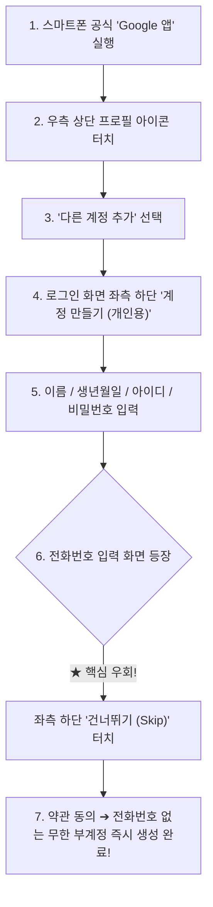

# ⚡ Free API Harvest Hub (Developer & AI Services Auto-Provisioning Skill)

본 스킬은 21개의 글로벌 개발자 & AI 서비스에서 **무료 플랜(Free Tier) API 키 및 자격 증명을 전자동/반자동으로 수집, 검증, 로테이션**하여 로컬 및 클라우드(OCI, Vercel, Supabase 등) 봇/에이전트에 주입할 수 있도록 설계된 전문 에이전트 스킬입니다.

---

## 📱 0. 【출발점】 스마트폰 '구글 앱'으로 전화번호 없이 무한 부계정 생성 공식

PC 환경에서 구글 계정을 만들면 100% 전화번호 SMS 인증이 강제되어 다계정 생성이 막힙니다.  
**반드시 스마트폰(iOS/Android)의 공식 "Google 앱"**을 통해 계정을 생성해야 전화번호 입력을 `건너뛰기`할 수 있습니다. 이것이 45개 이상의 무료 API 계정을 확보하는 절대적인 첫 단추입니다.



### 💡 모바일 부계정 생성 꿀팁
1. **사파리/크롬 웹이 아닌 공식 "Google 앱" 사용**: 모바일 OS의 디바이스 신뢰 토큰을 타기 때문에 번호 인증을 강제하지 않습니다.
2. **Wi-Fi보다 모바일 데이터(LTE/5G) 권장**: 동일 IP에서 연속 생성 시 번호 요구가 뜰 수 있으므로, 비행기 탑승 모드를 3초 켰다 끄면 IP가 리셋되어 계속 생성 가능합니다.
3. **통일된 비밀번호 규칙 권장**: 대량 계정 관리를 위해 `YOUR_PASSWORD_HERE` 등 통일된 비밀번호를 지정해 에이전트 자동화 스크립트에 바로 등록합니다.

---

## 🎯 1. 21개 전체 서비스 리스트 & 성공 노하우 (21 Verified Services)

| 번호 | 서비스명 | 실증 성공 키 규격 | 검증된 성공 방법 및 노하우 | 에이전트 핵심 활용처 |
| :---: | :--- | :--- | :--- | :--- |
| **1** | **GitHub** 🏆 | `ghp_...` (Classic PAT) | • 신규 계정 가입 시 Gmail에서 8자리 인증코드 추출 자동화<br>• `repo`, `workflow`, `write:packages`, `admin:org` 부여<br>• 발급 완료 즉시 41개 레포 스타 및 팔로우 자동 처리 | 원격 CI/CD 트리거, 패키지 배포, 자동 커밋/PR |
| **2** | **Google AI Studio** 🏆 | `AIzaSy...` (Gemini 2.5) | • Google 로그인 후 `https://aistudio.google.com/app/apikey` 직행<br>• 기본 프로젝트 자동 생성 후 Default Key 1초 만에 복사<br>• 전화번호 인증 없이 즉시 발급 가능 | Gemini 2.5 Flash / Pro 고속 대본 생성, 초거대 컨텍스트 처리 |
| **3** | **Groq Cloud** 🏆 | `gsk_...` (Llama 3.3) | • Google 계정으로 즉시 연동<br>• 800 tps 초고속 추론 및 Whisper Large v3 무료 STT | 실시간 보이스 에이전트, 초고속 텍스트 요약 |
| **4** | **Cohere** 🏆 | `2ew...` (API Key) | • Google OAuth 후 API Keys 메뉴 진입<br>• Rerank 3 및 Embed v3 무료 호출 지원 | RAG 검색 결과 정밀 재정렬, 벡터 임베딩 |
| **5** | **OpenRouter** 🏆 | `sk-or-v1-...` | • 단일 엔드포인트로 수백 개 LLM 라우팅<br>• Claude 3.5 Sonnet, GPT-4o, DeepSeek 등을 동시 Fallback | 레이트리밋 우회, 무료 모델 풀 배치 작업 |
| **6** | **Hugging Face** 🏆 | `hf_...` (Access Token) | • Settings > Access Tokens에서 Read/Write 토큰 발급<br>• Serverless Inference API 무료 제공 | 오픈소스 모델 추론, Spaces 데모 자동 배포 |
| **7** | **ElevenLabs** 🏆 | `sk_...` | • Google OAuth 후 온보딩 설문 `건너뛰기`<br>• Profile > API Keys에서 신규 키 생성 즉시 10,000자 무료 획득 | 유튜브 쇼츠 / 릴스 / 틱톡 감정선 있는 한국어 성우 더빙 |
| **8** | **Resend** 🏆 | `re_...` | • 가입 직후 API Keys 메뉴에서 `Create API Key` 클릭<br>• 매월 3,000건 이메일 발송 무료 쿼터 즉시 활성화 | 알림 이메일, 가입 인증 메일, 리포트 자동 발송 |
| **9** | **Tavily AI Search** 🏆 | `tvly-dev-...` | • AI 에이전트에 최적화된 검색 엔진 (광고/불필요 태그 제거)<br>• 매월 1,000회 웹 검색 무료 제공 | 최신 뉴스 검색, 실시간 인터넷 커뮤니티 레전드 썰 수집 |
| **10** | **Firecrawl** 🏆 | `fc-...` | • JS 렌더링 SPA 페이지를 깔끔한 클린 마크다운으로 변환<br>• 매월 1,000페이지 무료 크롤링 | 동적 웹사이트 데이터 추출, 문서 자동 스크래핑 |
| **11** | **Neon Postgres** 🏆 | `napi_...` | • Git 스타일 브랜칭 지원 Serverless PostgreSQL<br>• 0.5GB 무료 저장소 + 쿼리 없을 때 Auto-suspend로 무과금 유지 | 메인 관계형 데이터베이스, pgvector 기반 시맨틱 검색 |
| **12** | **Turso (LibSQL)** 🏆 | `eyJ...` (JWT Token) | • 전 세계 엣지 위치에 1ms 미만 지연시간 분산 SQLite<br>• 로컬 파일과 원격 클라우드 실시간 양방향 동기화 | 엣지 분산 캐시, 테넌트별 독립 마이크로 DB |
| **13** | **Supabase** 🏆 | `sbp_...` + Anon/Service | • 조직(Org) 생성 후 Access Token 발급<br>• 무료 Postgres DB + Auth 인증 + Storage + Realtime 통합 제공 | 풀스택 백엔드 인프라, 실시간 데이터 동기화 |
| **14** | **Cloudflare R2** 🏆 | `cfat_...` + S3 Key | • 가입 직후 R2 대시보드에서 `Manage R2 API Tokens` 생성<br>• S3 호환 엔드포인트 제공<br>• **Egress(다운로드 전송료) 완전 0원**으로 비디오 CDN 최적화 | 영상/이미지 호스팅 S3 스토리지, Workers 엣지 함수 |
| **15** | **Cloudinary** 🏆 | API Key & Secret | • 온더플라이(URL 파라미터) 이미지/동영상 변환<br>• 9:16 쇼츠 세로 크롭, 워터마크 자동 합성 무료 | 숏폼 영상 자막 오버레이, 썸네일 자동 생성 |
| **16** | **PostHog** 🏆 | `phc_...` | • 유저 마우스 이동 및 화면 재생(Session Replay) 무료<br>• 매월 1,000,000 이벤트 무료 트래킹 | 유저 행동 분석, 피처 플래그 ON/OFF 토글 |
| **17** | **Mux Video** 🏆 | Token ID / Secret | • 동영상 업로드 즉시 HLS 스트리밍 URL 자동 생성<br>• Whisper 기반 자막 자동 추출 | 유튜브/틱톡 수준의 고화질 비디오 스트리밍 인프라 |
| **18** | **Clerk Auth** 🏆 | Publishable / Secret Key | • 대시보드 생성 즉시 50,000 MAU 무료 유저 인증 활성화<br>• Next.js / React 원클릭 로그인 컴포넌트 제공 | 유저 로그인, 세션 관리, 다중 소셜 로그인 |
| **19** | **Upstash (Redis)** 🏆 | REST URL / Token | • 서버리스 환경 최적화 HTTP REST Redis<br>• 분당 API 호출수 제한(`@upstash/ratelimit`)과 작업 큐(QStash) 지원 | API 요청 제한기, 분산 락, 비동기 메시지 큐 |
| **20** | **Jina AI** 🏆 | `jina_...` | • URL 앞에 `r.jina.ai/` 붙여 웹 문서를 즉각 LLM용 텍스트로 리더 변환<br>• 1M 토큰 무료 제공 | 웹페이지 즉시 텍스트화, 검색 임베딩 |
| **21** | **MongoDB Atlas** 🏆 | Public/Private Key | • Free M0 클러스터 생성 후 API 키 발급<br>• 512MB 무료 영구 저장소 | NoSQL 도큐먼트 데이터베이스 |

---

## 🧭 2. 21개 전체 서비스 직통 가입 및 키 생성 페이지 (Direct Links)

1. **GitHub PAT**: [https://github.com/settings/tokens/new](https://github.com/settings/tokens/new) (Scopes: `repo`, `workflow`, `write:packages`, `admin:org`)
2. **Google AI Studio (Gemini)**: [https://aistudio.google.com/app/apikey](https://aistudio.google.com/app/apikey)
3. **Groq Cloud**: [가입 및 키 생성](https://console.groq.com/keys)
4. **Cohere**: [회원가입](https://dashboard.cohere.com/welcome/register) ➔ [API 키](https://dashboard.cohere.com/api-keys)
5. **OpenRouter**: [회원가입](https://openrouter.ai/auth) ➔ [API 키](https://openrouter.ai/keys)
6. **Hugging Face**: [가입](https://huggingface.co/join) ➔ [Access Tokens](https://huggingface.co/settings/tokens)
7. **ElevenLabs**: [가입](https://elevenlabs.io/sign-up) ➔ [API Keys](https://elevenlabs.io/app/settings/api-keys)
8. **Resend**: [가입](https://resend.com/signup) ➔ [API Keys](https://resend.com/api-keys)
9. **Tavily AI**: [가입](https://app.tavily.com/sign-up) ➔ [Dashboard](https://app.tavily.com/home)
10. **Firecrawl**: [가입](https://www.firecrawl.dev/signup) ➔ [API Keys](https://www.firecrawl.dev/app/api-keys)
11. **Neon Tech**: [가입](https://console.neon.tech/register) ➔ [API Keys](https://console.neon.tech/app/settings/api-keys)
12. **Turso**: [가입](https://turso.tech/app) ➔ [Tokens](https://app.turso.tech/settings/tokens)
13. **Supabase**: [가입](https://supabase.com/dashboard/sign-up) ➔ 조직(Org) 생성 ➔ [Access Tokens](https://supabase.com/dashboard/account/tokens)
14. **Cloudflare**: [가입](https://dash.cloudflare.com/sign-up) ➔ [API Tokens](https://dash.cloudflare.com/profile/api-tokens)
15. **Cloudinary**: [가입](https://cloudinary.com/users/register_free) ➔ [API Keys](https://console.cloudinary.com/settings/api-keys)
16. **PostHog**: [가입](https://us.posthog.com/signup) ➔ [Project Settings](https://us.posthog.com/project/settings)
17. **Mux Video**: [가입](https://dashboard.mux.com/signup) ➔ [Access Tokens](https://dashboard.mux.com/settings/access-tokens)
18. **Clerk Auth**: [가입](https://dashboard.clerk.com/sign-up) ➔ [API Keys](https://dashboard.clerk.com/)
19. **Upstash**: [가입](https://console.upstash.com/login) ➔ [Console](https://console.upstash.com/)
20. **Jina AI**: [API Keys](https://jina.ai/)
21. **MongoDB Atlas**: [가입](https://www.mongodb.com/cloud/atlas/register) ➔ [API Keys](https://cloud.mongodb.com/v2#/account/apiKeys)

---

## ⚙️ 3. 자동화 구현 팁 & 브라우저 세팅 가이드

### A. 크롬 독립 프로필 격리
기존 사용자의 브라우저 쿠키와 충돌하지 않도록 개별 디렉토리로 격리 구동:
```bash
/Applications/Google\ Chrome.app/Contents/MacOS/Google\ Chrome \
  --profile-directory="Profile_Custom" \
  "https://accounts.google.com" &
```

### B. Google Onboarding 팝업 4단계 바이패스 공식
새로운 구글 계정으로 로그인할 때 뜨는 모달창은 항상 다음 4단계 키보드 네비게이션으로 100% 해제:
1. `나중에` 클릭
2. `취소` 클릭
3. `건너뛰기` 클릭
4. 프로필 동기화 `예` 클릭

### C. 3분 룰 (Strict 3-Minute Timeout)
* 특정 서비스에서 CAPTCHA, 전화번호 인증, 앱 승인 요구가 발생하거나 3분 이상 포커스가 안 잡힐 경우, **즉시 해당 단계를 중단하고 다음 서비스/다음 계정으로 넘어가 전체 파이프라인의 처리 속도를 보장**합니다.
